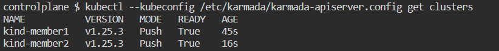

### Join member clusters to the host cluster

1. Join `kind-member1` and `kind-member2` to the host cluster.

   RUN `karmadactl --kubeconfig /etc/karmada/karmada-apiserver.config join kind-member1 --cluster-kubeconfig=$HOME/.kube/config-member1 --cluster-context=kind-member1`{{exec}}

   This joins the `kind-member1` cluster to the Karmada control plane using its kubeconfig file and context.

   RUN `karmadactl --kubeconfig /etc/karmada/karmada-apiserver.config join kind-member2 --cluster-kubeconfig=$HOME/.kube/config-member2 --cluster-context=kind-member2`{{exec}}

   This joins the `kind-member2` cluster to the Karmada control plane using its respective kubeconfig file and context.

2. Check Karmada resources.

   RUN `kubectl --kubeconfig /etc/karmada/karmada-apiserver.config get clusters`{{exec}}

   This command lists all the member clusters that have successfully joined the Karmada control plane.

3. Deploy one scheduler estimator for each member cluster. The estimator must be deployed in the host Kubernetes cluster, where `karmada-scheduler` runs, after the member kubeconfigs are available. The scheduler was initialized with `--enable-scheduler-estimator=true` in the previous step.

   RUN `mkdir -p /tmp/karmada-estimator/hack /tmp/karmada-estimator/artifacts/deploy && curl -sSL https://raw.githubusercontent.com/karmada-io/karmada/v1.18.2/hack/deploy-scheduler-estimator.sh -o /tmp/karmada-estimator/hack/deploy-scheduler-estimator.sh && curl -sSL https://raw.githubusercontent.com/karmada-io/karmada/v1.18.2/artifacts/deploy/karmada-scheduler-estimator.yaml -o /tmp/karmada-estimator/artifacts/deploy/karmada-scheduler-estimator.yaml && HOST_KUBECONFIG=${KUBECONFIG:-$HOME/.kube/config}; HOST_CONTEXT=$(kubectl config current-context --kubeconfig "$HOST_KUBECONFIG"); bash /tmp/karmada-estimator/hack/deploy-scheduler-estimator.sh "$HOST_KUBECONFIG" "$HOST_CONTEXT" $HOME/.kube/config-member1 kind-member1`{{exec}}

   RUN `HOST_KUBECONFIG=${KUBECONFIG:-$HOME/.kube/config}; HOST_CONTEXT=$(kubectl config current-context --kubeconfig "$HOST_KUBECONFIG"); bash /tmp/karmada-estimator/hack/deploy-scheduler-estimator.sh "$HOST_KUBECONFIG" "$HOST_CONTEXT" $HOME/.kube/config-member2 kind-member2`{{exec}}

   These commands create the estimator Deployments and Services in `karmada-system`, allowing the scheduler to query capacity for both member clusters.
4. The following image shows the expected output, indicating that the member clusters have been joined successfully.

> **Note:** If a join command fails due to a transient issue, rerun that specific join command.
